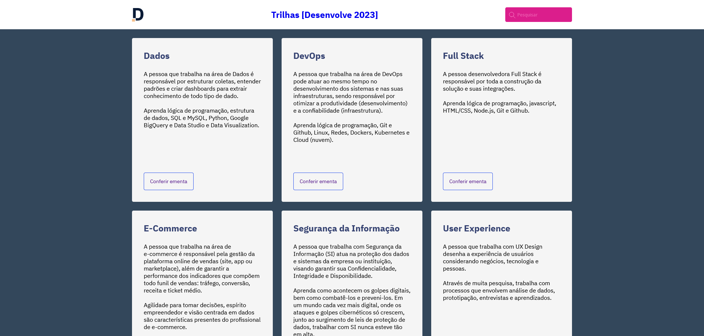
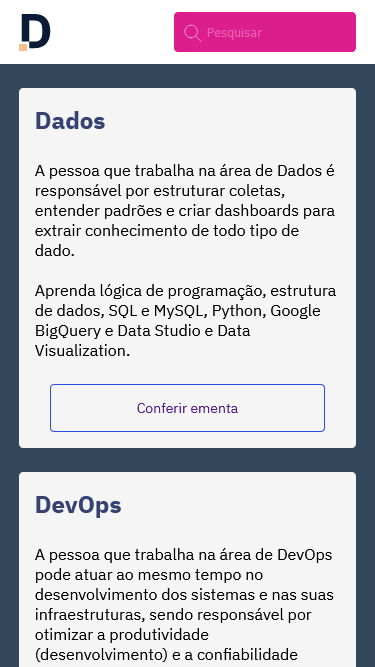

# Página do Programa Desenvolve (Grupo Boticário) - Desafio Mentoria
Página de releitura do contendo as trilhas do Programa Desenvolve.

## Screenshot

#### Desktop

#### Mobile

## Stack utilizada

- HTML5 
- CSS3
- Flexbox
- Mobile-first

## Aprendizados

•	Estruturar uma página responsiva partindo do design Figma

•	Versionar o código e subir para repositório no Git Hub

•	Hospedar a página com o GitHub Pages

## Demonstração

https://danilo-tx.github.io/HTML-CSS-TrilhasDesenvolve-DesafioMentoria/